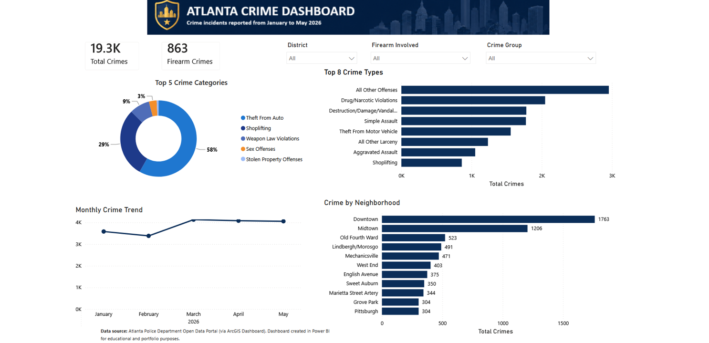

# 🚔 Atlanta Crime Dashboard (Power BI)

This project is an interactive dashboard created in Power BI to analyse crime data in Atlanta. The dashboard presents key insights through interactive visualisations, allowing users to explore crime trends, compare neighbourhoods, identify crime hotspots, and analyse incidents over time.

The project involved preparing and transforming crime data, building a data model, creating DAX measures, and designing an interactive dashboard to support data-driven decision-making.

## 🎯 Project Aim

The main goals of this project were to:

- Prepare and transform crime data for analysis.
- Analyse crime trends using Power BI.
- Build an interactive dashboard with filters and visualisations.
- Identify patterns across crime categories, locations, and time.
- Present the results in a clear and easy-to-understand format.

## 📊 Live Dashboard

🔗 **[View the Interactive Power BI Dashboard](https://app.powerbi.com/view?r=eyJrIjoiOGVlOTEzNTEtZWYwMS00MDMzLWFiYjktZTU0NjU4ZTY0Nzg3IiwidCI6IjNlYTdjMTI4LWM2MDEtNDQ3OS1hMDAzLWUxNGQwMGMwYjVjYiJ9)**

## 📂 Dataset

The dataset contains historical crime records from Atlanta. Each record includes information about the crime category, date and time, location, neighbourhood, police beat, and geographic coordinates.

The data was prepared and transformed in Power BI before being analysed to create the interactive dashboard.

The main columns include:

| Column | Description |
|---------|-------------|
| `Crime Type` | Category of crime |
| `Date` | Date of the incident |
| `Time` | Time of the incident |
| `Neighbourhood` | Area where the crime occurred |
| `Police Beat` | Police beat responsible for the area |
| `Latitude` | Latitude coordinate |
| `Longitude` | Longitude coordinate |

## 🧹 Data Preparation

Before creating the dashboard, the data was prepared by:

- Cleaning missing and duplicate records.
- Standardising data formats.
- Transforming data using Power Query.
- Creating relationships between tables.
- Building DAX measures for KPIs and calculations.

## 📊 Features

- Crime trend analysis
- Crime category comparison
- Neighbourhood analysis
- Interactive maps
- KPI cards
- Interactive dashboard with filters and slicers

## 🛠️ Tools Used

- Power BI Desktop
- Power Query
- DAX
- Data Modelling
- Data Visualisation

## 📁 Files

- [Power BI Report](dashboard/CrimeDashboard_atlanta.pbix) – Source Power BI report for the interactive dashboard.

## 📷 Dashboard Preview

The dashboard allows users to interact with the data using filters to explore crime trends by neighbourhood, crime category, and time.

## ❓ Business Questions Answered

This dashboard helps answer questions such as:

- Which crime categories occur most frequently?
- Which neighbourhoods report the highest crime levels?
- How does crime change over time?
- Where are crime hotspots located?
- What trends can be identified across different locations?

## 📈 Key Insights

- Property crime is the most common crime category.
- Crime levels vary across neighbourhoods.
- Some periods record noticeably higher crime activity than others.
- Interactive maps help identify crime hotspots across Atlanta.

## ⚠️ Challenges Faced

During this project, I faced a few challenges that helped me improve my Power BI and data analysis skills.

- Cleaning inconsistent data and preparing it for analysis using Power Query.
- Building an efficient data model with appropriate relationships.
- Writing DAX measures to calculate KPIs and dynamic metrics.
- Designing an interactive dashboard that presents large amounts of information without becoming cluttered.

By overcoming these challenges, I improved my Power BI skills, gained confidence in data modelling and DAX, and learned how to communicate insights through interactive dashboards.

## 🎯 Skills Demonstrated

- Data cleaning
- Data transformation
- Power Query
- Data modelling
- DAX
- Interactive dashboard design
- Data visualisation
- Business intelligence
- Turning raw data into clear business insights

## 🚀 About This Project

This project is part of my data analytics portfolio. It helped me improve my Power BI skills, particularly in data modelling, DAX, dashboard design, and data visualisation.

During this project, I learned how to transform raw crime data into interactive dashboards and present meaningful insights in a clear and engaging way. I look forward to continuing to build projects using Power BI and other data analytics tools.

## 👤 Author

**Wioletta Zajac**
